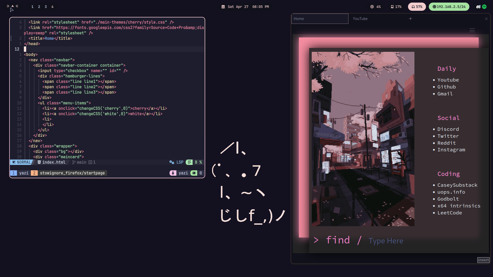
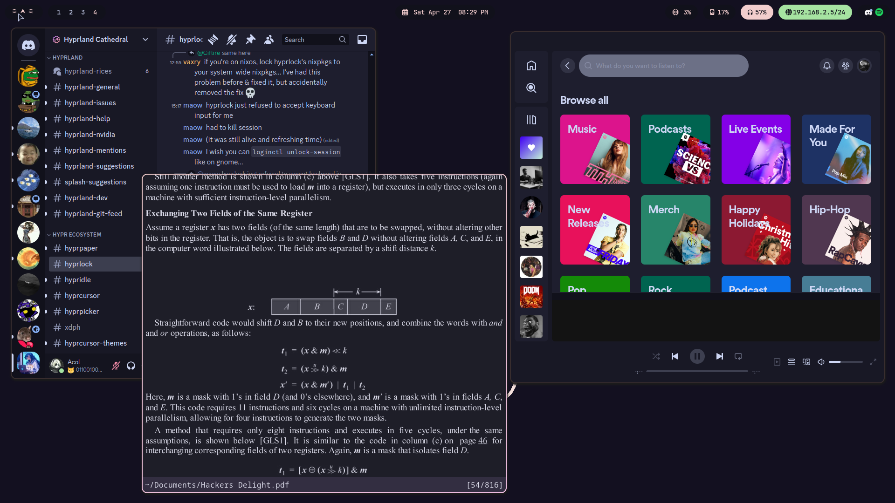

# Dotfiles


<br>


### Git

```
pacman -S git
```
### Stow

```
pacman -S stow
```

## Installation

Grab [paru](https://github.com/Morganamilo/paru) -> Install all apps bellow ->
clone this repo and stow -> do settings described below

```bash
git clone https://github.com/NotAcol/dotfiles.git
cd dotfiles
```

Stow to create symlinks

```bash
stow .
```

If stow doesnt work


```bash
git add .
stow --adopt .
git restore .
```

### zap

in zsh terminal

```bash
zsh <(curl -s https://raw.githubusercontent.com/zap-zsh/zap/master/install.zsh) --branch release-v1
zap update all
chsh -s /usr/bin/zsh
```

# APPS

### General

```bash
paru -S thefuck tealdeer fzf bat exa zoxide \
zsh nvim tmux nvchad-git yazi trashy ripgrep fd \
man man-pages pass btop duf peaclock zatura \
zathura-pdf-mupdf s glow epy-ereader-git dunst \
gimp cava qalculate-gtk spotify-launcher \
ventoy fastfetch qbittorrent silicon webcord  \
update-grub polkit thunar thunar-archive-plugin \
nomacs perl-image-exiftool brightnessctl \
python-pygments spicetify-cli discordo zipa p7zip \
ttf-jetbrains-mono-nerd noto-fonts noto-fonts-emoji \
obs-studio-rc ffmpeg-obs cef-minimal-obs-rc-bin \
waybar rofi-lbonn-wayland-git wl-clipboard \
polkit-kde-agent qt5-wayland qt6-wayland \
qt5ct networkmanager wf-recorder v4l2loopback-dkms 
```

### Audio

```bash
paru -S pipewire gst-plugin-pipewire pipewire-alsa \
pamixer pipewire-audio pipewire-jack pipewire-pulse \
wireplumber pavucontrol playerctl mpv mpd ncmpcpp \
noise-suppression-for-voice
```

### Theme stuff

```bash
paru -S catppuccin-mocha-grub-theme-git catppuccin-gtk-theme-mocha \
papirus-icon-theme kvantum nwg-look \
kvantum-theme-catppuccin-git 
```

Paru settings

```bash
sudo nvim /etc/pacman.conf
```

- uncomment Color

```bash
sudo nvim /etc/paru.conf
```

- uncomment BottomUp
- uncomment SudoLoop
- uncomment NewsOnUpgrade

```bash
paru --gendb
```

Add a pacman hook to clear old cache

```bash
sudo touch /etc/pacman.d/hooks/paccache.hook
sudo nvim /etc/pacman.d/hooks/paccache.hook
```

```text
[Trigger]
Operation = Remove
Operation = Install
Operation = Upgrade
Type = Package
Target = *

[Action]
Description = Keep the last cache and the currently installed.
When = PostTransaction
Exec = /usr/bin/paccache -rvk2
```


<details>
<summary>Spotify</summary>
<br>

#### Spotify wayland fix

```bash
sudo nvim /etc/spotify-launcher.conf
```
- uncomment extra_arguments = ["--enable-features=UseOzonePlatform", "--ozone-platform=wayland"]


#### Spotify theme

- Login to spotify

```bash
nvim ~/dotfiles/.config/spicetify/config-xpui.ini
```

- Edit path to use correct user name

```bash
spicetify apply
```

#### Block spotify ads

```bash
sudo nvim /etc/hosts
```

```text
127.0.0.1 media-match.com
127.0.0.1 adclick.g.doublecklick.net
127.0.0.1 www.googleadservices.com
127.0.0.1 open.spotify.com
127.0.0.1 pagead2.googlesyndication.com
127.0.0.1 desktop.spotify.com
127.0.0.1 googleads.g.doubleclick.net
127.0.0.1 pubads.g.doubleclick.net
127.0.0.1 audio2.spotify.com
127.0.0.1 www.omaze.com
127.0.0.1 omaze.com
127.0.0.1 bounceexchange.com
# 127.0.0.1 spclient.wg.spotify.com
127.0.0.1 securepubads.g.doubleclick.net
127.0.0.1 8.126.154.104.bc.googleusercontent.com
127.0.0.1 104.154.126.8
```

</details>

#### Bat theme

```bash
wget -P "$(bat --config-dir)/themes" https://github.com/catppuccin/bat/raw/main/themes/Catppuccin%20Mocha.tmTheme
bat cache --build
```

<details>
<summary>Tmux</summary>
<br>

#### Tmux plugins

```bash
git clone https://github.com/tmux-plugins/tpm ~/.tmux/plugins/tpm
tmux source ~/.tmux.conf
```

- ctrl+space I

#### Tmux changed keybinds

- Prefix = Ctrl + space
- Prefix + v/h/x to make vertical/horizontal/kill pane
- Ctrl + vim keys to move around panes
- Alt + h/l to move to prev/next window
- Alt + j/k to create/kill window
- Prefix + r to rename session
- Prefix + X to kill session


</details>


#### Nvim setup

```bash
nvim
```

- :MasonInstallAll
- :Lazy sync

#### Update tealdeer manpages

```bash
tldr --update
```

Remember to set up nwg-look and kvantum to catppuccin-mocha-flamingo

<details>
<summary>Firefox</summary>
<br>

[Grab betterfox](https://github.com/yokoffing/Betterfox)

#### Addons

[Ublock Origin](https://github.com/yokoffing/Betterfox), [Tridactyl](https://addons.mozilla.org/en-US/firefox/addon/tridactyl-vim/?utm_source=addons.mozilla.org&utm_medium=referral&utm_content=search), [Dark Reader](https://addons.mozilla.org/en-US/firefox/addon/darkreader/), [Youtube Dislike](https://addons.mozilla.org/en-US/firefox/addon/return-youtube-dislikes/?utm_source=addons.mozilla.org&utm_medium=referral&utm_content=search)

Add [blocklists](https://github.com/yokoffing/filterlists#guidelines)

#### Rice

Add [Catppuccin theme](https://github.com/catppuccin/firefox)

- about:config
- toolkit.legacyUserProfileCustomizations.stylesheets -> true
- about:profiles -> Root Directory
- pkill -f firefox
- cp -r ~/dotfiles/stowignore_firefox/startpage ./
- start firerfox and it should work

>Big thanks to [this](https://github.com/Haruzona/penguinFox) repo for the css files

#### Custom Home Page

- Settings -> Home -> New Windows and Tabs
- Custom URLs...
- file:///home/YOUR-USERNAME/dotfiles/stowignore_firefox/startpage/index.html

you can edit the home page to whatever now

</details>

### Hyprland

```bash
paru -S hyprcursor hyprlock \
hypridle hyprpaper xdg-desktop-portal-hyprland \
grimblast-git 
```

### Bluetooth

```bash
paru -S bluez bluez-utils bluetuith
sudo systemctl enable --now bluetooth.service
```

### Grub theme

```bash
sudo cp -r /usr/share/grub/themes/catppuccin-mocha/ /boot/grub/themes/
sudo nvim /etc/default/grub
```
- uncomment GRUB_THEME
- GRUB_THEME="/boot/grub/themes/catppuccin-mocha/theme.txt"

```bash
sudo grub-mkconfig -o /boot/grub/grub.cfg
```

>Can skip making the config here if nvidia gpu

### Using obs as virtual cam

```bash
paru -S linux-headers v4l2loopback-dkms
sudo touch /etc/modules-load.d/v4l2loopback.conf
sudo nvim /etc/modules-load.d/v4l2loopback.conf
```
add

```text
v4l2loopback
```

>Will work after reboot

# NVIDIA

```bash
paru -S nvidia-dkms nvidia-utils nvidia-settings \
libva-nvidia-driver libva-utils  lib32-nvidia-utils \
linux-headers vdpauinfo 
```

```bash
sudo nvim /etc/default/grub
```

```text
GRUB_CMDLINE_LINUX_DEFAULT="loglevel=3 quiet nvidia.NVreg_PreserveVideoMemoryAllocations=1 nvidia_drm.modeset=1 amd_pstate=active"
```
>Remove amd_pstate=active if no amd cpu
```bash
sudo grub-mkconfig -o /boot/grub/grub.cfg
sudo nvim /etc/mkinitcpio.conf
```
```text
MODULES=(btrfs nvidia nvidia_modeset nvidia_uvm nvidia_drm)
```

```bash
sudo mkinitcpio -p linux
sudo mkdir /etc/pacman.d/hooks/ 
sudo touch /etc/pacman.d/hooks/nvidia.hook
sudo nvim /etc/pacman.d/hooks/nvidia.hook
```
```text
[Trigger]

Operation=Install
Operation=Upgrade
Operation=Remove
Type=Package
### Uncomment the installed NVIDIA package
Target=nvidia
#Target=nvidia-open
#Target=nvidia-lts
### If running a different kernel, modify below to match
Target=linux

[Action]
Description=Updating NVIDIA module in initcpio
Depends=mkinitcpio
When=PostTransaction
NeedsTargets
Exec=/bin/sh -c 'while read -r trg; do case rg in linux*) exit 0; esac; done; /usr/bin/mkinitcpio -P'
```

```bash
vdpauinfo
vainfo
```

VAEntrypointEncVLD good 👍

```bash
sudo systemctl enable --now nvidia-suspend.service
sudo systemctl enable --now nvidia-hibernate.service
sudo systemctl enable --now nvidia-resume.service
```

>Maybe install xorg-xwayland-explicit-sync-git if flickerig persists after reboot

## Vulkan/Dev stuff

```bash
sudo pacman -S vulkan-devel vulkan-icd-loader \
lib32-vulkan-icd-loader glm glfw benchmark \
clang llvm ninja gef lld gitui openssh
```

```bash
vulkaninfo
vkcube
vkcube-wayland
```

There are two gdb configs, the second one is in ~/dotfiles/stowignore_gdb_configs/

#### Some scripts 

> Monitors a file for changes and outputs assembly
- monitor [cpp file in current dir]

> Disassembles and prints syntax highlighted assembly with bat
- disassemble [file in current dir]
