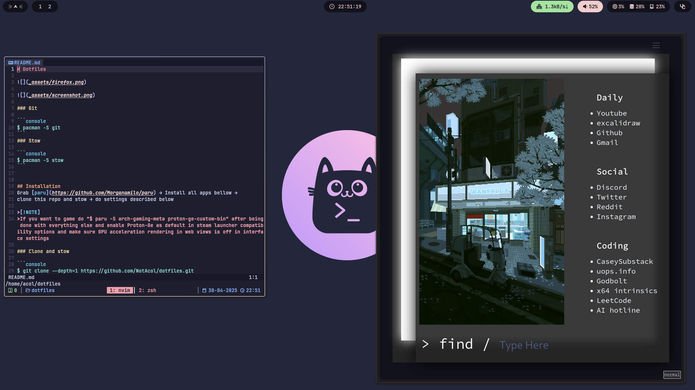

# Dotfiles




### Git

```bash 
pacman -S git
```
### Stow

```bash 
pacman -S stow
```

## Installation
Grab [paru](https://github.com/Morganamilo/paru) → Install all apps bellow →
clone this repo and stow → do settings described below 

>[!NOTE] 
If you want to game do '$ paru -S arch-gaming-meta proton-ge-custom-bin`
after doing everything else, enable Proton-Ge as default in steam launcher 
compatibility options and turn off GPU acceleration rendering in web views 
from interface settings.

### Clone and stow

```bash 
git clone --depth=1 https://github.com/NotAcol/dotfiles.git
cd dotfiles
```

Stow to create symlinks

```bash 
stow .
```

If stow doesn't work


```bash 
git add .
stow --adopt .
git restore .
```

# APPS

## Before installing apps 
### Chaotic-aur

```bash 
su -
pacman-key --recv-key 3056513887B78AEB --keyserver keyserver.ubuntu.com
pacman-key --lsign-key 3056513887B78AEB
pacman -U 'https://cdn-mirror.chaotic.cx/chaotic-aur/chaotic-keyring.pkg.tar.zst' 'https://cdn-mirror.chaotic.cx/chaotic-aur/chaotic-mirrorlist.pkg.tar.zst'
nvim /etc/pacman.conf
```

then under multilib add

```text
[chaotic-aur]
Include = /etc/pacman.d/chaotic-mirrorlist
```
> [!NOTE]
> more info [here](https://github.com/chaotic-aur)

```bash
sudo pacman -S reflector
sudo reflector --sort rate --latest 20 --protocol https --save /etc/pacman.d/mirrorlist
```

```bash 
sudo pacman -S archlinux-xdg-menu
sudo update-desktop-database 
```

## General

```bash 
paru -S man tealdeer bat eza atuin pacman-contrib dunst fish \
fisher neovim yazi gtrash-bin zoxide ripgrep fd duf rsync dua-cli \
neovide bat-extras man-pages jq poppler grim slurp satty aria2 \
zathura-pdf-mupdf fzf ffmpeg carapace-bin brightnessctl starship \
cava qalculate-gtk spotify-launcher ventoy fastfetch hypridle waybar \
freeze discord update-grub hyprpolkitagent polkit dolphin qt6ct \
nomacs xdg-desktop-portal-hyprland zip 7zip libnewt zen-browser-bin \
python-pygments spicetify-cli hyprland-qtutils clipse uwsm runapp \
ttf-jetbrains-mono-nerd rar zathura noto-fonts noto-fonts-emoji \
qbittorrent rofi-wayland rofi-emoji wl-clipboard w3m onlyoffice-bin \
tmux qt5-wayland qt6-wayland swww gnuplot hyprlock hyprcursor pass  \
mission-center udiskie firewalld
```

> [!NOTE]
> if there are issues with missing font icons you can do `paru -S nerd-fonts-complete-mono-glyphs`

## Systemd

The persistent journal can get big enough (4GiB) to the point where it 
slows down startup so change it to some smaller value
```bash
journalctl -b -u systemd-journald
sudo nvim /etc/systemd/journald.conf
```
and add 
```text
SystemMaxUse=50M
```

## File System
> [!NOTE]
> Use btrfs for file system, maybe bcachefs later down the line. Snapchots on arch are a life saver

```bash
paru -S timeshift xorg-xhost grub-btrfs 
```

> [!NOTE]
> xorg-xhost is there cause timeshift is retarded and cant open itself with root on wayland
If it ever gets fixed remove it it's just a security risk 

## Laptop Power Saving

```bash
paru -S tlp
sudo nvim /etc/tlp.conf
```
Add 
```text
# Do not suspend USB devices
USB_AUTOSUSPEND=0
```
If you are on prime laptop do lspci | grep NVIDIA and 
add the result to the comf file
```text
RUNTIME_PM_ENABLE="01:00.0"
```

## Shell

```fish
fisher update
fish_config theme save "Catppuccin Mocha"
```

## Audio

> [!WARNING]
> Pipewire and wireplubmer confs only work for my desktop

```bash 
paru -S pipewire gst-plugin-pipewire pipewire-alsa \
pamixer pipewire-audio pipewire-jack pipewire-pulse \
wireplumber pavucontrol coppwr-bin playerctl mpv mpd rmpc \
noise-suppression-for-voice python-mutagen yt-dlp mpd-mpris
mkdir -p ~/.local/share/mpd/playlists
systemctl --user enable --now pipewire.socket
systemctl --user enable --now pipewire-pulse.socket
systemctl --user enable --now wireplumber.service
systemctl --user enable --now mpd
sudo nvim /usr/lib/systemd/user/mpd-mpris.service
```

modify ExecStart to this
```txt
ExecStart=/usr/bin/mpd-mpris -network "unix" -host "/tmp/mpd_socket"
```

```bash
echo "[Unit]\nDescription=Keep track of media player activity\n\n[Service]\nExecStart=/usr/bin/playerctld daemon\nRestart=on-failure\n\n[Install]\nWantedBy=default.target" > ~/.config/systemd/user/playerctld.service
systemctl --user --now enable playerctld
systemctl --user --now enable mpd-mpris
```

## Network

```bash 
paru -S networkmanager nm-connection-editor
sudo systemctl enable --now NetworkManager.service
```

>$ nmtui

## Bluetooth

```bash 
paru -S bluez bluez-utils blueberry
sudo systemctl enable --now bluetooth.service
```

## Connection to phone

```bash 
paru -S kdeconnect sshfs
```
> [!NOTE]
> This app goes fucking hard works with iphone and on every os from what I can tell
 There is some permissions you have to set on phone side but it's great.

## tmux

Grab TPM

```bash 
git clone https://github.com/tmux-plugins/tpm ~/.tmux/plugins/tpm 
tmux
```
press ctrl+space+I

### tmux key binds

Prefix is ctrl+space

- prefix + []   navigate left right windows
- prefix + dt   close open windows
- prefix + vhx  vertical horizontal kill pane
- prefix + X    kill session
- ctrl + hjkl   go to left up down right pane

## Nvim setup

```bash 
sudo pacman -S luarocks
nvim
```

- :Lazy sync
- :MasonToolsUpdate

## Update tealdeer manpages

```bash 
tldr --update
```

## Paru 

> [!NOTE]
> Use `sudo pacman -Qdtq | sudo pacman -Rns -` every now and then to remove 
unneeded packages. Would add a hook for it but cba :3

```bash 
sudo nvim /etc/pacman.conf
```

- Uncomment: Color, VerbosePkgLists, ParallelDownloads
- Add ILoveCandy

```bash 
sudo nvim /etc/paru.conf
```

- Uncomment: BottomUp
- Uncomment: SudoLoop
- Uncomment: NewsOnUpgrade

```bash 
paru --gendb
```

```bash 
sudo touch /etc/pacman.d/hooks/paccache.hook
sudo nvim /etc/pacman.d/hooks/paccache.hook
```

```text
[Trigger]
Operation = Remove
Operation = Install
Operation = Upgrade
Type = Package
Target = *

[Action]
Description = Keep the last cache and the currently installed.
When = PostTransaction
Exec = /usr/bin/paccache -rvk2
```

```bash 
sudo mkinitcpio -P
```

## Zen Browser

### about:config

| setting | value |
| :---: | :---: |
| media.hardware-video-decoding.force-enabled | true |
| media.ffmpeg.vaapi.enabled | true |
| media.av1.enabled | false |
| gfx.x11-egl.force-enabled | true |
| widget.dmabuf.force-enabled | true |


### Add-ons

- [Ublock Origin](https://github.com/yokoffing/Betterfox)
- [Vimium C](https://addons.mozilla.org/en-US/firefox/addon/vimium-c/)
- [Dark Reader](https://addons.mozilla.org/en-US/firefox/addon/darkreader/)
- [Youtube Row Fixer](https://addons.mozilla.org/en-US/firefox/addon/youtube-row-fixer-extension/)

##### Add [blocklists](https://github.com/yokoffing/filterlists#guidelines)

> [!NOTE] 
> VimiumC settins in _zen/

## Discord

Just get vencord from [here](https://vencord.dev/download/) and theme it with [catppuccin css](https://github.com/catppuccin/discord?tab=readme-ov-file)

## Spotify

#### Spotify wayland fix

```bash 
sudo nvim /etc/spotify-launcher.conf
```
uncomment: extra_arguments = ["--enable-features=UseOzonePlatform", "--ozone-platform=wayland"]

#### Block Spotify ads
> [!NOTE]
> Probably dont do this except if spicetify doesnt block adds for you

```bash 
sudo nvim /etc/hosts
```

```text
127.0.0.1 media-match.com
127.0.0.1 adclick.g.doublecklick.net
127.0.0.1 www.googleadservices.com
127.0.0.1 open.spotify.com
127.0.0.1 pagead2.googlesyndication.com
127.0.0.1 desktop.spotify.com
127.0.0.1 googleads.g.doubleclick.net
127.0.0.1 pubads.g.doubleclick.net
127.0.0.1 audio2.spotify.com
127.0.0.1 www.omaze.com
127.0.0.1 omaze.com
127.0.0.1 bounceexchange.com
# 127.0.0.1 spclient.wg.spotify.com
127.0.0.1 securepubads.g.doubleclick.net
127.0.0.1 8.126.154.104.bc.googleusercontent.com
127.0.0.1 104.154.126.8
```

## Obs 

```bash 
paru -S obs-studio obs-vaapi obs-vkcapture lib32-obs-vkcapture \
obs-gstreamer
```


## Rice

```bash 
paru -S catppuccin-mocha-grub-theme-git catppuccin-gtk-theme-mocha \
papirus-icon-theme kvantum nwg-look kvantum-theme-catppuccin-git qqc2-desktop-style
```

Set up nwg-look and kvantum to catppuccin-mocha-flamingo
https://catppuccin.github.io/discord/dist/catppuccin-mocha.theme.css

### Zen theme

#### Add custom css
- about:config
- toolkit.legacyUserProfileCustomizations.stylesheets → true
- about:profiles → Root Directory

```bash 
pkill -f zen-bin
cp -r ~/dotfiles/_zen/chrome ./
```
Start zen and it should work

#### Custom Home Page

- Settings → Home → New Windows and Tabs
- Custom URLs...
- File:///home/YOUR-USERNAME/dotfiles/_zen/startpage/index.html

### Bat theme

```bash 
wget -P "$(bat --config-dir)/themes" https://github.com/catppuccin/bat/raw/main/themes/Catppuccin%20Mocha.tmTheme
bat cache --build
```

### Spotify theme

Log in to spotify

```bash 
spicetify apply
```

### Grub theme

```bash 
sudo cp -r /usr/share/grub/themes/catppuccin-mocha/ /boot/grub/themes/
sudo nvim /etc/default/grub
```

GRUB_THEME="/boot/grub/themes/catppuccin-mocha/theme.txt"

```bash 
sudo grub-mkconfig -o /boot/grub/grub.cfg
```

# NVIDIA

```bash 
paru -S nvidia-dkms nvidia-utils lib32-nvidia-utils nvidia-settings \
libva-nvidia-driver libva-utils vdpauinfo linux-headers egl-wayland \
cuda wayland-protocols xorg-xwayland
```
> cuda package kinda big, but it helped with davinci resolve 👍

```bash 
sudo nvim /etc/default/grub
```

```text
GRUB_CMDLINE_LINUX_DEFAULT="loglevel=3 quiet nvidia.NVreg_PreserveVideoMemoryAllocations=1 nvidia_drm.modeset=1 amd_pstate=active"
```

>Remove amd_pstate=active if no amd cpu

```bash 
sudo grub-mkconfig -o /boot/grub/grub.cfg
sudo nvim /etc/mkinitcpio.conf
```

```text
MODULES=(... nvidia nvidia_modeset nvidia_uvm nvidia_drm ...)
```

```bash 
sudo touch /etc/modprobe.d/nvidia.conf
sudo nvim /etc/modprobe.d/nvidia.conf
```

```text
options nvidia_drm modeset=1
```

```bash 
sudo mkinitcpio -P
```

### Pacman hook

```bash 
sudo mkdir /etc/pacman.d/hooks/ 
sudo touch /etc/pacman.d/hooks/nvidia.hook
sudo nvim /etc/pacman.d/hooks/nvidia.hook
```

```text
[Trigger]
Operation=Install
Operation=Upgrade
Operation=Remove
Type=Package
# Uncomment the installed NVIDIA package
Target=nvidia-dkms
#Target=nvidia-open
#Target=nvidia-lts
# If running a different kernel, modify below to match
Target=linux

[Action]
Description=Updating NVIDIA module in initcpio
Depends=mkinitcpio
When=PostTransaction
NeedsTargets
Exec=/bin/sh -c 'while read -r trg; do case $trg in linux*) exit 0; esac; done; /usr/bin/mkinitcpio -P'
```

Tests after reboot

```bash 
vdpauinfo
vainfo
```

VAEntrypointEncVLD good 👍

```bash 
sudo systemctl enable nvidia-suspend.service
sudo systemctl enable nvidia-hibernate.service
sudo systemctl enable nvidia-resume.service
```

Maybe install xorg-xwayland-explicit-sync-git if flickering persists after reboot

# Dev stuff

```bash 
paru -S vulkan-devel vulkan-icd-loader git-delta inotify-tools \
lib32-vulkan-icd-loader glm glfw linux-tools python-catppuccin \
clang llvm ninja lazygit python-pygments ctags \
libc++abi libc++ imhex-bin valgrind fasm
```

> Grab the template for .gitconfig from dotfiles/_gitstuff for delta integration, you also need the bad theme

# SSH

```bash
paru -S sshs openssh 
```

on the server 

```bash
systemctl enable --now sshd
sudo nvim /etc/ssh/sshd_config
```

Change the port to whatever you want instead of 22. You can connect to it with
```bash
ssh -p port user@server-address
```

The config for whatever client will go in ~/.ssh/config and will look somehting like this
```text
Host displayed-name
    HostName server-address
    User user
    Port port
```
and you can now connect with 
```bash
ssh displayed-name
```
Now create an ssh key in the user by doing (do name it tho when it promts "file in which to save")
```bash
cd ~/.ssh
ssh-keygen -t rsa -b 4096
chmod 600 ./key_name.pub
scp key_name.pub displayed-name:
rm ./key_name.pub
```
note the : at the end, it will make it so things are saved to home folder

now switch to the server (or just ssh to it)
```bash
mkdir ~/.ssh
touch ~/.ssh/authorized_keys
cat ~/key_name.pub >> ~/.ssh/authorized_keys
rm ~/key_name.pub
```

After you have connected with the client and gotten a key force auth_key loggin with
```text
PasswordAuthentication no
PubkeyAuthentication yes
AuthenticationMethods publickey
```
and uncomment the AuthorizedKeysFile

restart the server
```bash
systemctl restart sshd
```

To connect you will either do
```bash
ssh -p port -i key_name user@server-address
```
or add `IdentifyFile key_name` to the ~/.ssh/config entry

Next time you want to add a user just enable password authentication 

## Dynamic DNS
This all is assuming router doesnt support freedns if it does just go play with those settings..

Go [here](https://freedns.afraid.org/) create subdomain and 
set wrong ip for it, go to Dynamic DNS right click copy Dyrect Url

```bash
paru -S freedns-daemon
sudo nvim /etc/freedns-daemon/urls
```
and paste the link you copied

```bash
systemctl enable --now freedns-daemon
```

Now you need to forward a router port to the ssh port from before and you can connect 
from the internet instead of only local network with
```bash
ssh -p router-port user@dns-subdomain.com
```

# Academics

## LaTeX
```bash 
paru -S texlive-latexrecommended texlive-latexextra texlive-mathscience \
texlive-binextra texlive-fontsrecommended texlive-langgreek 
```

## Matlab/Mathematica for the poors
```bash 
paru -S sagemath sagemath-doc
```

## Misc
```bash 
paru -S obsidian pandoc
```

put this in obsidian vault .obsidian/snippets/erm.css
```css
body {
  --file-line-width:1000px
}
```

<p align="center">
	
</p>
