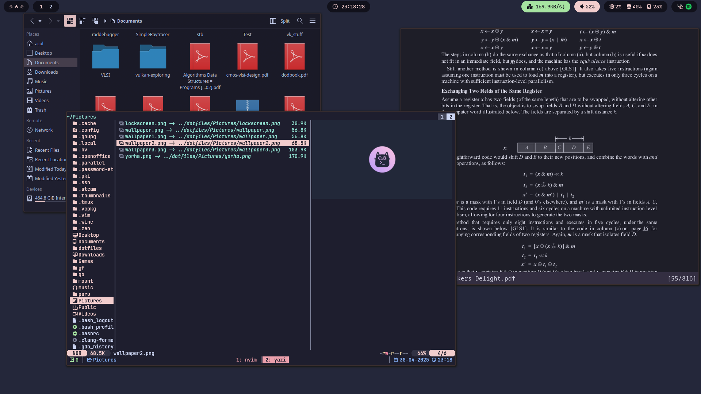

# Dotfiles




### Git

```console
$ pacman -S git
```
### Stow

```console
$ pacman -S stow
```


## Installation
Grab [paru](https://github.com/Morganamilo/paru) → Install all apps bellow →
clone this repo and stow → do settings described below 

>[!NOTE] 
>If you want to game do "$ paru -S arch-gaming-meta proton-ge-custom-bin" after being done with everything else and enable Proton-Ge as default in steam launcher compatibility options and make sure GPU acceleration rendering in web views is off in interface settings

### Clone and stow

```console
$ git clone --depth=1 https://github.com/NotAcol/dotfiles.git
$ cd dotfiles
```

Stow to create symlinks

```console
$ stow .
```

If stow doesn't work


```console
$ git add .
$ stow --adopt .
$ git restore .
```

# New kernel

I use the linux-zen kernel cause it's faster :).

```console
$ paru -S linux-zen linux-zen-headers update-grub
$ update-grub
```
you will also have to change `Target=linux` to `Target=linux-zen` in the [nvidia pacman hook](<README#Pacman hook>)
# Locales
To add new locales do `sudo nvim /etc/locale.gen` and uncomment the locale you want and run `sudo local-gen`
> [!TIP]
> Big preference to utf8

# APPS


## Before installing apps 

```console
$ su -
# pacman-key --recv-key 3056513887B78AEB --keyserver keyserver.ubuntu.com
# pacman-key --lsign-key 3056513887B78AEB
# pacman -U 'https://cdn-mirror.chaotic.cx/chaotic-aur/chaotic-keyring.pkg.tar.zst' 'https://cdn-mirror.chaotic.cx/chaotic-aur/chaotic-mirrorlist.pkg.tar.zst'
# nvim /etc/pacman.conf
```
then under multilib add
```text
[chaotic-aur]
Include = /etc/pacman.d/chaotic-mirrorlist
```
> [!NOTE]
> more info [here](https://github.com/chaotic-aur)

```
$ sudo pacman -S reflector
$ sudo reflector --sort rate --latest 20 --protocol https --save /etc/pacman.d/mirrorlist
```

## General

```console
$ paru -S thefuck tealdeer fzf bat exa zoxide atuin choose \
zsh neovim yazi trashy ripgrep fd unarchiver duf gdu starship \
man bat-extras man-pages pass zathura jq poppler grimblast-git \
zathura-pdf-mupdf s glow epy-ereader-git dunst zen-browser-bin \
cava qalculate-gtk spotify-launcher ventoy fastfetch hypridle \
qbittorrent silicon vesktop update-grub polkit dolphin qt5ct \
tmux gvfs mirage perl-image-exiftool xdg-desktop-portal-hyprland \
python-pygments spicetify-cli zip p7zip hyprland-qtutils \
ttf-jetbrains-mono-nerd noto-fonts noto-fonts-emoji waybar \
rofi-lbonn-wayland-git wl-clipboard clipse hyprpolkitagent \
qt5-wayland qt6-wayland wf-recorder hyprpaper brightnessctl \
hyprcursor hyprlock ffmpegthumbnailer \
```

> [!WARNING]
> Using the avx2 version of the zen browser. If you have an older cpu use zen-browser-bin

> [!WARNING]
> if there are issues with missing font icons do `paru -S nerd-fonts-complete-mono-glyphs`


## Audio

```console
$ paru -S pipewire gst-plugin-pipewire pipewire-alsa \
pamixer pipewire-audio pipewire-jack pipewire-pulse \
wireplumber pavucontrol playerctl mpv mpd ncmpcpp \
noise-suppression-for-voice
```
## Network

```console
$ paru -S networkmanager
$ sudo systemctl enable --now NetworkManager.service
```

>$ nmtui

## Bluetooth

```console
$ paru -S bluez bluez-utils bluetuith
$ sudo systemctl enable --now bluetooth.service
```

## Obs 

```console
$ paru -S obs-studio obs-vaapi obs-vkcapture-git lib32-obs-vkcapture-git \
obs-rtspserver obs-gstreamer ffmpeg-obs cef-minimal-obs-rc-bin xdg-desktop-portal-wlr
```
For image editing use [affinity](https://github.com/Twig6943/AffinityOnLinux) products (adobe straight up doesnt work) and for video use davinci but not aur version it perma breaks
> [!note]
> You can install affinity products using just a script from [here](https://github.com/ryzendew/AffinityOnLinux) just check if it's up to date

### Using obs for virtual cam

```console
$ paru -S linux-headers v4l2loopback-dkms
$ sudo touch /etc/modules-load.d/v4l2loopback.conf
$ sudo nvim /etc/modules-load.d/v4l2loopback.conf
```

Add

```text
v4l2loopback
```

>Will work after reboot


## Zsh with zap

In zsh terminal

```console
$ zsh <(curl -s https://raw.githubusercontent.com/zap-zsh/zap/master/install.zsh) --branch release-v1
```

>This might back up and replace .zshrc if it does switch them back to this repo's version

```console
$ zap update all
$ chsh -s /usr/bin/zsh
$ atuin import auto
```

Better use trashy instead of rm

zsh is set to vi key binds if you want emacs change it at ~/.zshrc line 48

If you want to sync search history across machines you can trivially do it [here](https://docs.atuin.sh/guide/sync/)

## tmux

Grab TPM

```console
$ git clone https://github.com/tmux-plugins/tpm ~/.tmux/plugins/tpm 
$ tmux
```
press ctrl+space+I

### tmux key binds

Prefix is ctrl+space

- prefix + []   navigate left right windows
- prefix + dt   close open windows
- prefix + vhx  vertical horizontal kill pane
- prefix + X    kill session
- ctrl + hjkl   go to left up down right pane

## WezTerm key binds
ctrl + shift + 
- S horizontal split
- A vertical split
- T new tab
- Z zooming into a pane
- HJKL select left up down right pane
- X kill pane
- {} left right tab

## Nvim setup

```console
$ sudo pacman -S luarocks
$ nvim
```

- :Lazy sync
- :MasonToolsInstallsync

## Paru 

> [!NOTE]
> Use `sudo pacman -Qdtq | sudo pacman -Rns -` every now and then to remove unneeded packages. Would add a hook for it but cba :3

```console
$ sudo nvim /etc/pacman.conf
```

- Uncomment: Color, VerbosePkgLists, ParallelDownloads
- Add ILoveCandy

```console
$ sudo nvim /etc/paru.conf
```

- Uncomment: BottomUp
- Uncomment: SudoLoop
- Uncomment: NewsOnUpgrade

```console
$ paru --gendb
```

Add a pacman hook to clear old cache

```console
$ sudo touch /etc/pacman.d/hooks/paccache.hook
$ sudo nvim /etc/pacman.d/hooks/paccache.hook
```

```text
[Trigger]
Operation = Remove
Operation = Install
Operation = Upgrade
Type = Package
Target = *

[Action]
Description = Keep the last cache and the currently installed.
When = PostTransaction
Exec = /usr/bin/paccache -rvk2
```

## Update tealdeer manpages

```console
$ tldr --update
```

## GIMP
Using [PhotGIMP](https://github.com/Diolinux/PhotoGIMP/tree/master), it might need update if 3.0 ever comes out XD
> [!WARNING]
> Scratch that, gimp blows too much dick it's unusable. Maybe use krita?

## Catppuccinification

```console
$ paru -S catppuccin-mocha-grub-theme-git catppuccin-gtk-theme-mocha \
catppuccin-cursors-moch apapirus-icon-theme kvantum nwg-look kvantum-theme-catppuccin-git 
```

- Set up nwg-look and kvantum to catppuccin-mocha-flamingo
- Copy the curosr theme you want from /usr/share/icons/ to ~/local/share/icons and select it in both nwg and hyprland.conf
> [!NOTE]
> nwg look cursor size 22 and hyprcursor 32 are the same
- vesktop theme https://catppuccin.github.io/discord/dist/catppuccin-mocha.theme.css


## Bat theme

```console
$ wget -P "$(bat --config-dir)/themes" https://github.com/catppuccin/bat/raw/main/themes/Catppuccin%20Mocha.tmTheme
$ bat cache --build
```

## Grub theme

```console
$ sudo cp -r /usr/share/grub/themes/catppuccin-mocha/ /boot/grub/themes/
$ sudo nvim /etc/default/grub
```

GRUB_THEME="/boot/grub/themes/catppuccin-mocha/theme.txt"

```console
$ sudo grub-mkconfig -o /boot/grub/grub.cfg
```

>Can skip making the config here if nvidia GPU

## Firefox

#### Moved to zen from firefox but same things apply just change firefox to zen in paths

[Grab betterfox](https://github.com/yokoffing/Betterfox)

### Add-ons

- [Ublock Origin](https://github.com/yokoffing/Betterfox)
- [Tridactyl](https://addons.mozilla.org/en-US/firefox/addon/tridactyl-vim/?utm_source=addons.mozilla.org&utm_medium=referral&utm_content=search)
- [Dark Reader](https://addons.mozilla.org/en-US/firefox/addon/darkreader/)
- [Youtube Dislike](https://addons.mozilla.org/en-US/firefox/addon/return-youtube-dislikes/?utm_source=addons.mozilla.org&utm_medium=referral&utm_content=search)
- [Auto Tab Discard](https://addons.mozilla.org/en-US/firefox/addon/auto-tab-discard/)

> [!NOTE]
> auto tab discard is built in to zen

##### Add [blocklists](https://github.com/yokoffing/filterlists#guidelines)

> [!NOTE] 
> if you are gonna use zen and trydactil do `:bind J tabnext` and `:bind K tabprev` to get more sane behavior

### Rice

##### Add [Catppuccin theme](https://github.com/catppuccin/firefox) (only needed for firefox)

##### Add custom css
- about:config
- toolkit.legacyUserProfileCustomizations.stylesheets → true
- about:profiles → Root Directory

```console
$ pkill -f firefox
$ cp -r ~/dotfiles/_firefox/chrome ./
```
Start firerfox and it should work

>Big thanks to [this](https://github.com/Haruzona/penguinFox) repo for the css files

### Custom Home Page

- Settings → Home → New Windows and Tabs
- Custom URLs...
- File:///home/YOUR-USERNAME/dotfiles/_firefox/startpage/index.html


### Nvidia + firefox

> [!IMPORTANT]
> You know if vaapi is working when on about:support in the Compositing field it has WebRender
> For now just with zen browser it just works with 
> - media.ffmpeg.vaapi.enabled true
> - gfx.webrender.all true

|  about:config |  |
| :-----------: | :-------------------------------: |
| media.ffmpeg.vaapi.enabled |true|
| media.rdd-ffmpeg.enabled |true|
| media.av1.enabled |false|
| gfx.x11-egl.force-enabled |true |
| widget.dmabuf.force-enabled |true|
| gfx.webrender.all |true|
| gfx.webrender.enabled |true|
| layers.acceleration.force-enabled |true|
| media.hardware-video-decoding.force-enabled |true |

## Spotify

#### Spotify wayland fix

```console
$ sudo nvim /etc/spotify-launcher.conf
```
uncomment: extra_arguments = ["--enable-features=UseOzonePlatform", "--ozone-platform=wayland"]


#### Spotify theme

Login to spotify

```console
$ nvim ~/dotfiles/.config/spicetify/config-xpui.ini
```

Edit path to use correct username

```console
$ spicetify backup apply
```

#### Block spotify ads

```console
$ sudo nvim /etc/hosts
```

```text
127.0.0.1 media-match.com
127.0.0.1 adclick.g.doublecklick.net
127.0.0.1 www.googleadservices.com
127.0.0.1 open.spotify.com
127.0.0.1 pagead2.googlesyndication.com
127.0.0.1 desktop.spotify.com
127.0.0.1 googleads.g.doubleclick.net
127.0.0.1 pubads.g.doubleclick.net
127.0.0.1 audio2.spotify.com
127.0.0.1 www.omaze.com
127.0.0.1 omaze.com
127.0.0.1 bounceexchange.com
# 127.0.0.1 spclient.wg.spotify.com
127.0.0.1 securepubads.g.doubleclick.net
127.0.0.1 8.126.154.104.bc.googleusercontent.com
127.0.0.1 104.154.126.8
```

# NVIDIA

```console
$ paru -S nvidia-dkms nvidia-utils nvidia-settings egl-wayland\
libva-nvidia-driver libva-utils vdpauinfo linux-headers\
cuda
```
> cuda package kinda big, but it helped with davinci resolve 👍

```console
$ sudo nvim /etc/default/grub
```

```text
GRUB_CMDLINE_LINUX_DEFAULT="loglevel=3 quiet nvidia.NVreg_PreserveVideoMemoryAllocations=1 nvidia_drm.modeset=1 nvidia_drm.fbdev=1 amd_pstate=active"
```

>Remove amd_pstate=active if no amd cpu

```console
$ sudo grub-mkconfig -o /boot/grub/grub.cfg
$ sudo nvim /etc/mkinitcpio.conf
```


```text
MODULES=(... nvidia nvidia_modeset nvidia_uvm nvidia_drm ...)
```

```console
$ sudo touch /etc/modprobe.d/nvidia.conf
$ sudo nvim /etc/modprobe.d/nvidia.conf
```

```text
options nvidia_drm modeset=1 fbdev=1
```

```console
$ sudo mkinitcpio -P
$ sudo mkdir /etc/pacman.d/hooks/ 
$ sudo touch /etc/pacman.d/hooks/nvidia.hook
$ sudo nvim /etc/pacman.d/hooks/nvidia.hook
```

### Pacman hook

```text
[Trigger]
Operation=Install
Operation=Upgrade
Operation=Remove
Type=Package
# Uncomment the installed NVIDIA package
Target=nvidia-dkms
#Target=nvidia-open
#Target=nvidia-lts
# If running a different kernel, modify below to match
Target=linux-zen

[Action]
Description=Updating NVIDIA module in initcpio
Depends=mkinitcpio
When=PostTransaction
NeedsTargets
Exec=/bin/sh -c 'while read -r trg; do case $trg in linux*) exit 0; esac; done; /usr/bin/mkinitcpio -P'
```

Tests after reboot

```console
$ vdpauinfo
$ vainfo
```

VAEntrypointEncVLD good 👍

```console
$ sudo systemctl enable nvidia-suspend.service
$ sudo systemctl enable nvidia-hibernate.service
$ sudo systemctl enable nvidia-resume.service
```

>Maybe install xorg-xwayland-explicit-sync-git if flickering persists after reboot

# Dev stuff

```console
$ paru -S vulkan-devel vulkan-icd-loader git-delta inotify-tools \
lib32-vulkan-icd-loader glm glfw linux-tools python-catppuccin \
clang llvm ninja pwndbg-git lazygit openssh python-pygments \
libc++abi libc++ tracy imhex-bin valgrind sshs fasm
```

> Grab the template for .gitconfig from dotfiles/_gitstuff for delta integration, you also need the bad theme

## LaTeX
```console
paru -S texlive-latexrecommended texlive-latexextra texlive-mathscience \
texlive-binextra texlive-fontsrecommended texlive-langgreek 
```


## GDB
- Added gdb support for nvim with dup and dupui for quick and dirty debug. Can do :enew | r !a.out to get an obj dump in a new buffer. 
- In cli gdb try `setup [0-3]` for different layouts

>[!NOTE]
> Nvim-dapui blows massive dick tho better just use pwndbg in different terminal window. (pls god ryan port the rad debugger alread)


